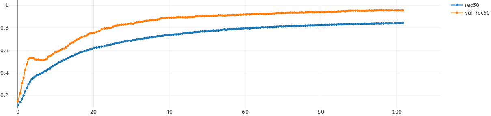
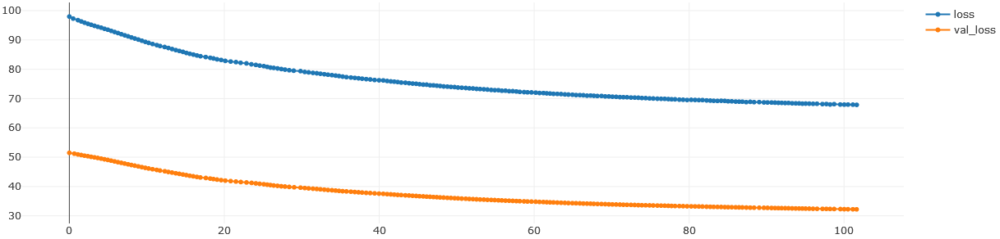

# Recommender System with Variational Autoencoder (VAE) using TensorFlow 2 and MLflow

This project implements a Recommender System using a Variational Autoencoder (VAE) with 
TensorFlow 2. The VAE-based Recommender System is designed to provide personalized 
recommendations for users based on their historical interactions with items (collaborative 
filtering). It supports
custom loss functions, metrics, and hyperparameters for model training, and provides a 
flexible architecture to incorporate additional user and item features. Training models are
versioned by MLflow with tracking of parameters, metrics, loss, datasets and models. The 
VAE recommender is tested against the user-item interactions from the 
[Movies Lens 20M](https://grouplens.org/datasets/movielens/20m/) dataset. This datasets 
includes user and item IDs. Related features (e.g. movie ratings)
are not considered.

## Environment

#### Build and run the recommender app
```bash
docker build -t recommender_app .
docker run -p 5000:5000 -d recommender_app
```

The recommender app MLflow UI will now be accessible at `http://localhost:5000`. Use this UI to
check models and experiments tracked by MLflow.

#### Train a model:
```bash
docker exec -it <container_id> python train.py --experiment_name 0 --model_name modelA --learning_rate 1e-4
```
To train a model, you can use the train.py script within the Docker container:

* **<container_id>**: Replace with the actual ID of your Docker container.
* **<experiment_name>**: Choose a name for your experiment.
* **<model_name>**: Specify a name for your model.
* **<learning_rate>**: Set the learning rate for model training.

#### Fine-tuning a trained model:
To fine-tune an existing trained model, you can use the following command within the Docker container:
```bash
docker exec -it <container_id> python train.py --experiment_name 0 --model_name modelA --model_version 2 --fine_tune True
```
* **<model_version>**: Specify the version of the model to fine-tune.
* Set the **--fine_tune** flag to True to indicate fine-tuning.

#### Model evaluation:
Evaluate a trained model's performance using the following command:
```bash
docker exec -it <container_id> python evaluate.py --model_name modelA --model_version 3   
```
* **<model_version>**: Specify the version of the model to evaluate.

An histogram of metrics will be created within the `eval_info` folder of the model artifacts.
Check it out in the MLflow UI.

#### Generating Recommendations:
Use the recommender system to generate personalized recommendations with this command:
```bash
docker exec -it <container_id> python recommend.py --model_name modelA --model_version 3 --top_k 10 --remove_train_items True
```
* **<model_version>**: Specify the version of the model to use for recommendations.
* **<top_k>**: Set the number of top recommendations to generate.
* **--remove_train_items True**: Optionally remove items seen in the training data from the recommendations.

Note that the above command does not produce anything meaningful. The code is written for
demonstrative purpose.

## Examples of training results

**Recall** and **NDGC** metrics are implemented. Recall measures the ability of a recommendation system to 
retrieve all relevant items while NDGC measures the quality of recommendations given the relevance 
of items. 

#### Recall@50


#### Loss (BCE + Kullback Leibler Divergence)


## License
This project is licensed under the [MIT License](LICENSE).